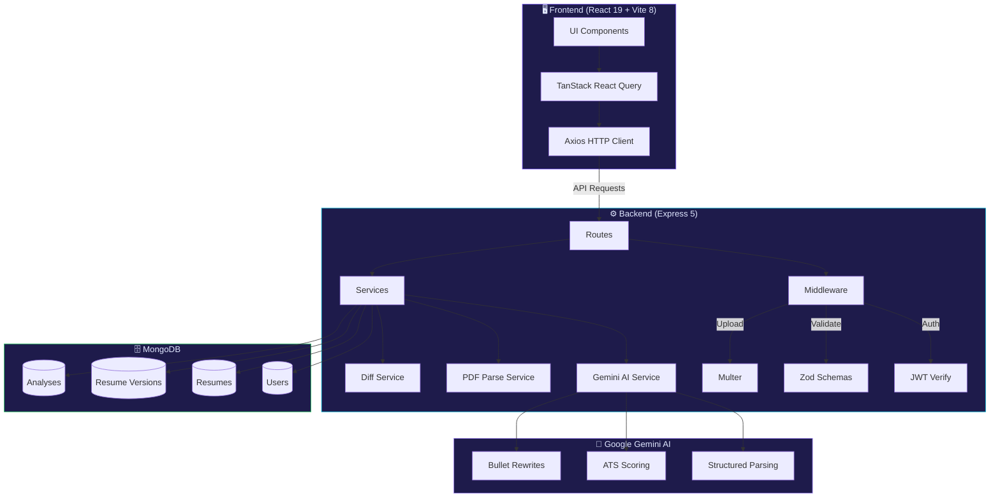

<](https://nodejs.org)
[](https://expressjs.com)
[](https://react.dev)
[](https://www.mongodb.com)
[](https://ai.google.dev)
[](https://tailwindcss.com)
[](https://vitejs.dev)
[](LICENSE)

<br />

<p align="center">
  <strong>A full-stack AI-powered ATS Resume Checker</strong> built with the <strong>MERN stack</strong> and <strong>Google Gemini AI</strong>.<br/>
  Upload your resume as a PDF → get an instant ATS score → fix issues with AI rewrites → track every improvement.
</p>

<br />

[🚀 Get Started](#-getting-started) · [✨ Features](#-features) · [📸 Screenshots](#-screenshots) · [🛠️ Tech Stack](#%EF%B8%8F-tech-stack) · [📡 API Reference](#-api-reference) · [🤝 Contributing](#-contributing)

<br />

</div>

---

## 🎯 What is AI Resume Roster?

> **AI Resume Roster** is an intelligent, full-stack resume analysis platform that helps job seekers optimize their resumes for Applicant Tracking Systems (ATS). Powered by **Google Gemini AI**, it provides instant scoring, actionable feedback, and AI-powered bullet rewrites — all wrapped in a beautiful, responsive UI.

<br />

<div align="center">

```
📄 Upload PDF  →  🤖 AI Analysis  →  📊 ATS Score  →  ✍️ AI Rewrites  →  📈 Track Progress
```

</div>

<br />

## ✨ Features

<table>
<tr>
<td width="50%">

### 🔐 Authentication & Security
- JWT auth with **httpOnly cookies**
- Passwords hashed with **bcrypt**
- Per-user **rate limiting** to prevent abuse
- **Zod** request validation on every route

### 📄 Smart Resume Upload
- **Drag-and-drop** or file picker (PDF only)
- 5 MB limit with file type validation
- Auto text extraction via **pdf-parse**
- Scanned/image PDF detection & warning

### 🤖 AI-Powered Analysis
- **ATS Score (0–100)** across keywords, formatting, impact & clarity
- **5 prioritized issues** with severity ratings & fix suggestions
- **5 evidence-based strengths** highlighting what works
- **Keyword gap analysis** — present vs missing keywords
- **5–10 AI bullet rewrites** with original → improved + rationale

</td>
<td width="50%">

### 📊 Analytics & Insights Dashboard
- Score evolution **charts** & **sparklines**
- Top recurring issues & missing keywords
- Per-resume performance table
- KPI cards with trend indicators

### 🔄 Version History & Diff
- Every upload/rewrite creates an **immutable version** (V1, V2, V3…)
- **Apply selected or all** AI rewrites with one click
- **Word-level & line-level diff** between any two versions
- Full chronological **activity feed**

### 🎨 Polished UI/UX
- **Light & Dark mode** with theme persistence
- **Framer Motion** animations throughout
- **Responsive** design — desktop, tablet, mobile
- **PDF export** of improved resume

</td>
</tr>
</table>

<br />

## 📸 Screenshots

<div align="center">

> 🖼️ *Screenshots coming soon — the app features a stunning dark-mode UI with glassmorphism effects, gradient accents, and smooth animations.*

</div>

<br />

## 🏗️ Architecture



<br />

## 🛠️ Tech Stack

<div align="center">

### Backend

| Technology | Version | Purpose |
|:---:|:---:|:---|
|  | ≥ 20 | Runtime environment |
|  | 5 | Web framework |
|  | 7+ | Database |
|  | 9 | MongoDB ODM |
|  | 2.5 Flash | AI analysis engine |
|  | 9 | Authentication |
|  | 4 | Schema validation |

### Frontend

| Technology | Version | Purpose |
|:---:|:---:|:---|
|  | 19 | UI library |
|  | 8 | Build tool & dev server |
|  | v4 | Styling framework |
|  | 12 | Animations |
|  | 3 | Charts & graphs |
|  | 5 | Server state management |
|  | 7 | Client-side routing |

</div>

<br />

## 📁 Project Structure

```
AI Resume Analyzer/
│
├── 📄 README.md
├── 📄 .gitignore
│
├── 🔧 backend/                          # Express.js API server
│   ├── .env                             # Environment variables (git-ignored)
│   ├── package.json
│   └── src/
│       ├── server.js                    # Entry point
│       ├── config/
│       │   ├── db.js                    # MongoDB connection
│       │   └── env.js                   # Env config loader
│       ├── middleware/
│       │   ├── auth.js                  # JWT authentication
│       │   ├── errorHandler.js          # Global error handler
│       │   ├── rateLimit.js             # Per-user rate limiting
│       │   ├── upload.js                # Multer PDF upload
│       │   └── validate.js              # Zod validation
│       ├── models/
│       │   ├── User.js                  # User schema
│       │   ├── Resume.js                # Resume schema
│       │   ├── ResumeVersion.js         # Version schema
│       │   └── Analysis.js              # Analysis schema
│       ├── routes/
│       │   ├── auth.js                  # /api/auth
│       │   ├── resume.js                # /api/resumes
│       │   ├── dashboard.js             # /api/dashboard
│       │   ├── insights.js              # /api/insights
│       │   ├── versions.js              # /api/versions
│       │   ├── history.js               # /api/history
│       │   └── health.js                # /api/health
│       ├── services/
│       │   ├── geminiService.js         # Gemini AI integration
│       │   ├── structuredParser.js      # AI resume parser
│       │   ├── pdfService.js            # PDF text extraction
│       │   └── diffService.js           # Word/line diff engine
│       └── utils/
│           ├── ApiError.js              # Custom error class
│           ├── asyncHandler.js          # Async route wrapper
│           └── jwt.js                   # JWT utilities
│
└── 🎨 frontend/
    └── ai-resume-checker-ui-boilerplate-code/
        ├── index.html
        ├── vite.config.js
        ├── package.json
        └── src/
            ├── main.jsx                 # React DOM root
            ├── App.jsx                  # App root + providers
            ├── routes.jsx               # Route config
            ├── index.css                # Global styles + Tailwind
            ├── api/                     # Axios API client
            ├── context/                 # Auth & Theme contexts
            ├── hooks/                   # Custom React hooks
            ├── lib/                     # Utility libraries
            ├── components/
            │   ├── ui/                  # Card, Button, Badge, etc.
            │   ├── layout/              # AppShell, Sidebar, Header
            │   ├── landing/             # Hero, Features, CTA sections
            │   ├── auth/                # Login/Register forms
            │   ├── resume/              # Upload, detail components
            │   ├── analysis/            # Score, issues, rewrites
            │   ├── dashboard/           # Dashboard widgets
            │   └── export/              # PDF export
            └── pages/
                ├── Landing.jsx
                ├── Login.jsx
                ├── Register.jsx
                ├── Dashboard.jsx
                ├── Resumes.jsx
                ├── ResumeDetail.jsx
                ├── Export.jsx
                ├── Insights.jsx
                ├── Versions.jsx
                ├── History.jsx
                └── Settings.jsx
```

<br />

## 🚀 Getting Started

### Prerequisites

Ensure you have the following installed:

| Requirement | Version | Link |
|:---|:---:|:---|
| **Node.js** | ≥ 20.x | [nodejs.org](https://nodejs.org) |
| **npm** | ≥ 10.x | Comes with Node.js |
| **MongoDB** | ≥ 7.x | [mongodb.com](https://www.mongodb.com/try/download/community) |
| **Git** | Latest | [git-scm.com](https://git-scm.com) |
| **Gemini API Key** | — | [aistudio.google.com](https://aistudio.google.com/app/apikey) |

### 1️⃣ Clone the Repository

```bash
git clone https://github.com/sailesh01-code/AI_Resume-Roster.git
cd AI_Resume-Roster
```

### 2️⃣ Backend Setup

```bash
# Navigate to backend
cd backend

# Install dependencies
npm install

# Create environment file
cp .env.example .env
# OR create manually and add:
```

Create a `backend/.env` file with:

```env
MONGO_URI=mongodb://localhost:27017/ai-resume-roaster
JWT_SECRET=your-super-secret-random-key-here
PORT=5000
GEMINI_API_KEY=your-google-gemini-api-key
GEMINI_MODEL=gemini-2.5-flash
```

> ⚠️ **Important:** Replace `JWT_SECRET` with a long random string and `GEMINI_API_KEY` with your actual key from [Google AI Studio](https://aistudio.google.com/app/apikey).

### 3️⃣ Frontend Setup

```bash
# Navigate to frontend (from project root)
cd frontend/ai-resume-checker-ui-boilerplate-code

# Install dependencies
npm install
```

### 4️⃣ Run the Application

You need **two terminals** running simultaneously:

```bash
# Terminal 1 — Backend
cd backend
npm run dev
# → Server starts at http://localhost:5000

# Terminal 2 — Frontend
cd frontend/ai-resume-checker-ui-boilerplate-code
npm run dev
# → App starts at http://localhost:5173
```

> 💡 The Vite dev server proxies all `/api/*` requests to `localhost:5000` automatically.

Open **http://localhost:5173** in your browser and you're ready to go! 🎉

<br />

## ⚙️ Environment Variables

All environment variables go in `backend/.env`:

| Variable | Required | Default | Description |
|:---|:---:|:---|:---|
| `MONGO_URI` | ✅ | `mongodb://localhost:27017/ai-resume-roaster` | MongoDB connection string |
| `JWT_SECRET` | ✅ | — | Secret key for signing JWT tokens |
| `GEMINI_API_KEY` | ✅ | — | Google Gemini AI API key |
| `PORT` | ❌ | `5000` | Backend server port |
| `GEMINI_MODEL` | ❌ | `gemini-2.5-flash` | Gemini model to use |
| `JWT_EXPIRES_IN` | ❌ | `7d` | JWT token expiry duration |
| `COOKIE_NAME` | ❌ | `arr_token` | Name of the auth cookie |
| `CLIENT_ORIGIN` | ❌ | `http://localhost:5173,5174` | Allowed CORS origins |
| `NODE_ENV` | ❌ | `development` | Environment mode |

<br />

## 📡 API Reference

<details>
<summary><b>🔐 Authentication</b> — <code>/api/auth</code></summary>
<br />

| Method | Endpoint | Description | Body |
|:---:|:---|:---|:---|
| `POST` | `/api/auth/register` | Register a new user | `{ name, email, password }` |
| `POST` | `/api/auth/login` | Login with credentials | `{ email, password }` |
| `POST` | `/api/auth/logout` | Logout (clears cookie) | — |
| `GET` | `/api/auth/me` | Get current user | — |
| `PATCH` | `/api/auth/profile` | Update profile | `{ name }` |

</details>

<details>
<summary><b>📄 Resumes</b> — <code>/api/resumes</code></summary>
<br />

| Method | Endpoint | Description |
|:---:|:---|:---|
| `POST` | `/api/resumes` | Upload a new resume (PDF, max 5 MB) |
| `GET` | `/api/resumes` | List all resumes for current user |
| `GET` | `/api/resumes/:id` | Get single resume with all versions |
| `DELETE` | `/api/resumes/:id` | Delete resume and all associated data |

</details>

<details>
<summary><b>🤖 AI Analysis & Rewrites</b></summary>
<br />

| Method | Endpoint | Description |
|:---:|:---|:---|
| `POST` | `/api/resumes/:id/analyze` | Run AI analysis (score, issues, rewrites) |
| `GET` | `/api/resumes/:id/analyses` | List all analyses for a resume |
| `GET` | `/api/resumes/:id/versions/:vid/analysis` | Get analysis for specific version |
| `POST` | `/api/resumes/:id/rewrite` | Apply rewrites → create new version |
| `GET` | `/api/resumes/:id/versions/:vid` | Get specific version data |

</details>

<details>
<summary><b>📊 Dashboard, Insights & History</b></summary>
<br />

| Method | Endpoint | Description |
|:---:|:---|:---|
| `GET` | `/api/dashboard` | Dashboard stats, charts, activity feed |
| `GET` | `/api/insights` | Aggregate analytics & insights |
| `GET` | `/api/versions` | Flat list of all versions (with filters) |
| `GET` | `/api/history` | Chronological account activity feed |
| `GET` | `/api/resumes/:id/diff?from=...&to=...&mode=words` | Compare two versions |
| `GET` | `/api/health` | Server health check |

</details>

<br />

## 🗺️ Frontend Routes

| Route | Page | Auth Required |
|:---|:---|:---:|
| `/` | Landing Page | ❌ |
| `/login` | Login | ❌ |
| `/register` | Registration | ❌ |
| `/dashboard` | Dashboard — KPIs, score chart, activity | ✅ |
| `/resumes` | Resume List — all uploaded resumes | ✅ |
| `/resumes/:id` | Resume Detail — analysis, rewrites, diff | ✅ |
| `/resumes/:id/export` | PDF Export — download improved resume | ✅ |
| `/insights` | Insights — analytics, trends, keywords | ✅ |
| `/versions` | Versions — flat list of all versions | ✅ |
| `/history` | History — chronological event feed | ✅ |
| `/settings` | Settings — profile, password, theme | ✅ |

<br />

## 📖 How to Use

<table>
<tr>
<td align="center" width="12%"><h3>1️⃣</h3></td>
<td><b>Create an Account</b> — Register with your name, email, and password (min 8 chars)</td>
</tr>
<tr>
<td align="center"><h3>2️⃣</h3></td>
<td><b>Upload Your Resume</b> — Drag-and-drop or browse for your PDF resume (max 5 MB)</td>
</tr>
<tr>
<td align="center"><h3>3️⃣</h3></td>
<td><b>Analyze</b> — Hit "Analyze" and optionally enter a target job role for better keyword matching</td>
</tr>
<tr>
<td align="center"><h3>4️⃣</h3></td>
<td><b>Review AI Feedback</b> — Browse Issues, Strengths, and Bullet Rewrites tabs</td>
</tr>
<tr>
<td align="center"><h3>5️⃣</h3></td>
<td><b>Apply Rewrites</b> — Select individual rewrites or apply all at once to create a new version</td>
</tr>
<tr>
<td align="center"><h3>6️⃣</h3></td>
<td><b>Compare Versions</b> — Use the diff tool to see word-level changes (green = added, red = removed)</td>
</tr>
<tr>
<td align="center"><h3>7️⃣</h3></td>
<td><b>Re-Analyze & Iterate</b> — Analyze the new version and track your ATS score improvement</td>
</tr>
<tr>
<td align="center"><h3>8️⃣</h3></td>
<td><b>Export</b> — Download your optimized resume as a clean PDF</td>
</tr>
</table>

<br />

## 🐛 Troubleshooting

<details>
<summary><b>❌ Cannot connect to MongoDB</b></summary>

- Ensure MongoDB is running locally (`mongod`) or use a [MongoDB Atlas](https://www.mongodb.com/cloud/atlas) connection string
- Check that port `27017` is not blocked
</details>

<details>
<summary><b>❌ Missing required env vars</b></summary>

- Ensure `backend/.env` exists with `MONGO_URI`, `JWT_SECRET`, and `GEMINI_API_KEY`
- The server will refuse to start if these are missing
</details>

<details>
<summary><b>❌ GEMINI_API_KEY is missing or invalid</b></summary>

- Get a free API key from [Google AI Studio](https://aistudio.google.com/app/apikey)
- Add it to `backend/.env` as `GEMINI_API_KEY=your-key-here`
</details>

<details>
<summary><b>❌ PDF upload fails or no text extracted</b></summary>

- Ensure the file is a real PDF (not a renamed `.jpg` or `.docx`)
- File must be under 5 MB
- Scanned/image-only PDFs may not have extractable text
</details>

<details>
<summary><b>❌ Frontend shows "Loading..." forever</b></summary>

- Ensure the backend is running on port `5000`
- Check the Vite proxy config in `vite.config.js`
- Open browser DevTools → Network tab for failed API calls
</details>

<details>
<summary><b>❌ Port already in use</b></summary>

- Change `PORT` in `backend/.env`
- Update the proxy target in `vite.config.js` accordingly
</details>

<br />

## 🤝 Contributing

Contributions are welcome! Here's how:

1. **Fork** the repository
2. **Create** your feature branch (`git checkout -b feature/amazing-feature`)
3. **Commit** your changes (`git commit -m 'Add amazing feature'`)
4. **Push** to the branch (`git push origin feature/amazing-feature`)
5. **Open** a Pull Request

<br />

## 📄 License

This project is for **educational and personal use**.

<br />

## 🙏 Acknowledgements

- [Google Gemini AI](https://ai.google.dev) — AI analysis engine
- [React](https://react.dev) — UI library
- [Tailwind CSS](https://tailwindcss.com) — Styling framework
- [MongoDB](https://www.mongodb.com) — Database
- [Framer Motion](https://www.framer.com/motion/) — Animations
- [Recharts](https://recharts.org) — Charts & data visualization

<br />

---

<div align="center">

**Built with ❤️ by [sailesh01-code](https://github.com/sailesh01-code)**

<br />


</div>
]]>
